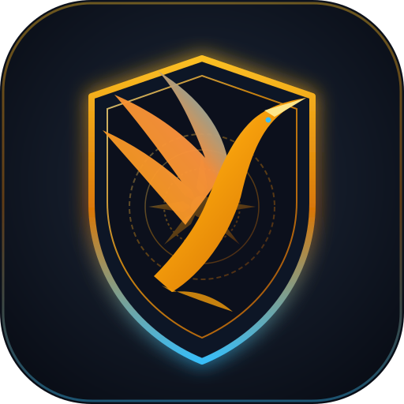

<div align="center">



# Vibird Browser

**Trình duyệt desktop siêu nhẹ, không ngốn RAM và bảo vệ quyền riêng tư tuyệt đối cho Linux.**  
*An ultra-lean, memory-safe, privacy-hardened desktop web browser for Linux workstations.*

[](https://github.com/LocShadowVN/VibirdBrowser/actions)
[](LICENSE)
[](#6-hướng-dẫn-cài-đặt-linux-x86_64)
[-red.svg?style=flat-square)](https://www.rust-lang.org/)
[](#21-lõi-chặn-quảng-cáo-vibird-shield-300k-rules-của-brave)
[](#1-tổng-quan-kiến-trúc)

[Bản Tiếng Việt](#tiếng-việt) • [English Documentation](#english)

</div>

---

<a name="tiếng-việt"></a>
## Bản Tiếng Việt

### Mục Lục
- [1. Tổng quan kiến trúc](#1-tổng-quan-kiến-trúc)
- [2. Các tính năng nổi bật](#2-các-tính-năng-nổi-bật)
  - [2.1. Lõi chặn quảng cáo Vibird Shield (300k+ rules của Brave)](#21-lõi-chặn-quảng-cáo-vibird-shield-300k-rules-của-brave)
  - [2.2. Chống lộ IP qua WebRTC & Giả lập Chrome WebBridge](#22-chống-lộ-ip-qua-webrtc--giả-lập-chrome-webbridge)
  - [2.3. Ru ngủ tab thông minh (Tự giải phóng RAM)](#23-ru-ngủ-tab-thông-minh-tự-giải-phóng-ram)
  - [2.4. Bóc mã theo dõi trên URL & Gỡ Google AMP](#24-bóc-mã-theo-dõi-trên-url--gỡ-google-amp)
  - [2.5. Tải file đa luồng xé băng thông như IDM](#25-tải-file-đa-luồng-xé-băng-thông-như-idm)
  - [2.6. Két lưu mật khẩu Argon2id & Tự động điền 1 chạm](#26-két-lưu-mật-khẩu-argon2id--tự-động-điền-1-chạm)
  - [2.7. Mã hoá truy vấn DNS (DNS-over-HTTPS)](#27-mã-hoá-truy-vấn-dns-dns-over-https)
- [3. So sánh thực tế: Vibird vs Chrome, Brave, Firefox](#3-so-sánh-thực-tế-vibird-vs-chrome-brave-firefox)
- [4. Độ tương thích web & Một số điểm cần lưu ý](#4-độ-tương-thích-web--một-số-điểm-cần-lưu-ý)
- [5. Hướng dẫn tự build từ mã nguồn](#5-hướng-dẫn-tự-build-từ-mã-nguồn)
- [6. Hướng dẫn cài đặt (Linux x86_64)](#6-hướng-dẫn-cài-đặt-linux-x86_64)
- [7. Lưu ý kỹ thuật & Tính chất bản thử nghiệm](#7-lưu-ý-kỹ-thuật--tính-chất-bản-thử-nghiệm)
- [8. Bản sắc thiết kế](#8-bản-sắc-thiết-kế)
- [9. Giấy phép mã nguồn mở](#9-giấy-phép-mã-nguồn-mở)

---

### 1. Tổng quan kiến trúc

Các trình duyệt Chromium hiện nay ngốn quá nhiều tài nguyên: mỗi tab mở ra là kéo theo hàng tá tiến trình con, dính telemetry theo dõi và nhồi nhét nhiều tính năng thừa thãi (ví tiền ảo, quảng cáo đối tác).

**Vibird Browser** chọn cách tiếp cận tách biệt 2 lớp độc lập:
1. **Giao diện điều khiển (Frontend WASM):** Toàn bộ thanh tab, thanh gõ URL, trang quản lý tải file và cài đặt được viết bằng **Rust (Leptos CSR)**, biên dịch ra WebAssembly. Giao diện chạy mượt, phản hồi tức thì và tốn cực ít RAM.
2. **Khung hiển thị web (Native WebKitGTK 4.1):** Trang web không chạy trong thẻ iframe mà được gắn thẳng vào subsurface của Linux, nằm khớp dưới thanh công cụ 92px. Nhờ tận dụng engine WebKit có sẵn trên hệ điều hành, máy chạy êm mát và chỉ ăn khoảng **~118MB RAM**.

```
+-----------------------------------------------------------------------------------------+
|                                    VIBIRD BROWSER                                       |
+-----------------------------------------------------------------------------------------+
|  GIAO DIỆN: Rust Leptos WASM (Chạy mượt, siêu nhẹ)                                      |
|  - Thanh Tab & Thanh địa chỉ Omnibox động                                               |
|  - Thanh Download Shelf báo tiến độ IDM theo thời gian thực                             |
|  - Các trang nội bộ: vibird://newtab | settings | vault | history | downloads           |
+-----------------------------------------------------------------------------------------+
                                          ▲
                         Giao tiếp qua Tauri v2 IPC (Bất đồng bộ)
                                          ▼
+-----------------------------------------------------------------------------------------+
|  BACKEND HỆ THỐNG: Rust (Tauri v2 + Tokio Async Runtime)                                |
|  +--------------------------------+  +-----------------------------------------------+  |
|  | WebKitGTK 4.1 Native           |  | Luồng chặn quảng cáo độc lập                  |  |
|  | - Viewport đồ họa mượt mà      |  | - Nhân adblock-rust của Brave (300k+ rules)   |  |
|  | - Cách ly bảo mật IPC          |  | - Tra cứu Bloom Filter tốc độ micro-giây      |  |
|  +--------------------------------+  +-----------------------------------------------+  |
|  +--------------------------------+  +-----------------------------------------------+  |
|  | Bộ tải đa luồng chuẩn IDM      |  | Két mật khẩu bảo mật cao (Vault)              |  |
|  | - Tách 4 đến 16 luồng TCP      |  | - Dẫn xuất khoá Argon2id (Mô hình Envelope)   |  |
|  | - Chống ghi đè Path Traversal  |  | - Mã hoá xác thực chuẩn AES-256-GCM           |  |
|  +--------------------------------+  +-----------------------------------------------+  |
|  +-----------------------------------------------------------------------------------+  |
|  | Cơ sở dữ liệu SQLite cục bộ (Lưu bookmarks, lịch sử, cấu hình ngoại lệ theo web) |  |
+-----------------------------------------------------------------------------------------+
```

---

### 2. Các tính năng nổi bật

#### 2.1. Lõi chặn quảng cáo Vibird Shield (300k+ rules của Brave)
- **Tách luồng chạy riêng:** Quá trình kiểm tra link theo dõi được đưa sang một thread OS riêng biệt chạy nhân `adblock-rust` chính thức của Brave. Lướt web nặng đến mấy thì giao diện thanh công cụ vẫn mượt, không bị đơ.
- **Nạp sẵn hơn 300.000 quy tắc:** Gom sẵn các bộ lọc nổi tiếng: EasyList (chặn quảng cáo), EasyPrivacy (chặn theo dõi ngầm) và Fanboy's Annoyance (dẹp banner rác). Bạn có thể ném thêm rules cá nhân vào `~/.local/share/vibird-browser/custom_rules.txt`.
- **Chặn sâu từ tầng DOM:** Can thiệp trực tiếp vào prototype tạo script, iframe ẩn, kết nối WebSocket và Beacon ngầm để diệt tracker trước khi trình duyệt kịp gửi request ra ngoài.
- **Chống nhận diện máy tính (Brave Farbling):** Bơm một chút nhiễu ngẫu nhiên siêu nhỏ vào Canvas và AudioContext. Mắt thường nhìn không thấy khác biệt, nhưng các công cụ theo dõi fingerprint (như FingerprintJS) sẽ bị "mù" hoàn toàn.
- **Tự dẹp banner Cookie & GDPR:** Tự đóng các bảng xin quyền cookie gây phiền phức (OneTrust, Cookiebot...), đồng thời mở khoá thanh cuộn trang nếu website cố tình đóng băng màn hình.

#### 2.2. Chống lộ IP qua WebRTC & Giả lập Chrome WebBridge
- **Bịt kín lỗ hổng lộ IP:** Can thiệp vào `RTCPeerConnection` để gỡ bỏ IP mạng LAN nội bộ (192.168.x.x, 10.x.x.x) khỏi gói tin bắt tay SDP. Bật VPN là an tâm không sợ bị lộ IP thật.
- **Đóng giả Google Chrome 130:** Tự động gửi User-Agent của Chrome trên Linux và bổ sung Client Hints (`navigator.userAgentData`). Giúp bạn truy cập bình thường vào các trang kén trình duyệt như Discord, Slack, Claude.
- **Bổ sung API Chrome:** Giả lập sẵn các hàm `window.chrome.runtime`, `csi()` để không bị vỡ giao diện trên các trang web tối ưu riêng cho Chromium.

#### 2.3. Ru ngủ tab thông minh (Tự giải phóng RAM)
- **Dọn sạch RAM cho máy:** Tab nào để nền **quá 10 phút không bấm tới** sẽ tự động được ru ngủ. Trình duyệt giải phóng hoàn toàn Webview của tab đó, trả lại 100% dung lượng RAM và tài nguyên GPU cho máy tính để bạn chạy IDE, Docker mượt mà.
- **Bấm là thức dậy ngay:** Khi bấm chọn lại tab đang ngủ, trang sẽ tự động tải lại đúng URL và trạng thái trước đó.

#### 2.4. Bóc mã theo dõi trên URL & Gỡ Google AMP
- **Dọn sạch link chia sẻ:** Tự động gọt sạch toàn bộ các đuôi theo dõi gián điệp (`fbclid`, `gclid`, `utm_source`, `utm_campaign`, `si`, `spm`...) trước khi truy cập.
- **Né Google AMP:** Tự nhận diện link trung gian Google AMP (`google.com/amp/s/` hoặc `ampproject.org`) và điều hướng thẳng về bài viết gốc của trang báo.

#### 2.5. Tải file đa luồng xé băng thông như IDM
- **Tải phân mảnh qua HTTP Range:** Nếu máy chủ cho phép tải từng phần, Vibird sẽ tự động chia nhỏ file ra từ **4 đến 16 luồng TCP tải song song** rồi ghép lại sau khi tải xong. Tốc độ vượt trội hoàn toàn so với tải 1 luồng mặc định của Chrome.
- **Bắt link tải tự động (Download Sniffer):** Bấm vào link file `.zip`, `.tar.gz`, `.iso`, `.deb`... là trình duyệt tự chuyển qua bộ tải đa luồng.
- **Chống lỗi ghi đè file:** Lọc bỏ toàn bộ ký tự nguy hiểm (`..`, `/`, `\`) trên tên file, đảm bảo an toàn cho thư mục hệ thống.

#### 2.6. Két lưu mật khẩu Argon2id & Tự động điền 1 chạm
- **Mã hoá Envelope siêu tốc:** Mật khẩu chủ được bảo vệ bằng hàm băm bộ nhớ cứng `Argon2id` (chống bẻ khoá bằng dàn trâu cày GPU). Sau khi mở khoá, giải mã cả trăm tài khoản bằng `AES-256-GCM` chỉ trong vài micro-giây, hoàn toàn không gây lag.
- **Điền form an toàn:** Nút Autofill xuất hiện ngay trên thanh URL khi vào đúng web. Bấm 1 chạm là điền xong tài khoản, dùng chuẩn JSON an toàn không lo lỗi tiêm mã độc.

#### 2.7. Mã hoá truy vấn DNS (DNS-over-HTTPS)
- Hỗ trợ gửi truy vấn tên miền qua TLS (RFC 8484), chống bị nhà mạng theo dõi lịch sử duyệt web hoặc chặn DNS.
- Có sẵn công cụ đo độ trễ mạng thực tế của Cloudflare, Quad9, Google ngay trong mục Cài đặt.

---

### 3. So sánh thực tế: Vibird vs Chrome, Brave, Firefox

| Tiêu chí | Vibird Browser | Brave Browser | Google Chrome | Mozilla Firefox |
| :--- | :--- | :--- | :--- | :--- |
| **Giao diện điều khiển** | **100% Rust WASM** | C++ Chromium | C++ Chromium | C++ / XUL / Gecko |
| **Nhân hiển thị (Render)**| **WebKitGTK 4.1 Native** | Blink / V8 (C++) | Blink / V8 (C++) | Gecko / SpiderMonkey |
| **RAM khi mở 1 tab chờ** | **~95 MB – 135 MB** 🟢 | ~550 MB – 750 MB 🔴 | ~600 MB – 900 MB 🔴 | ~450 MB – 650 MB 🟡 |
| **RAM khi mở 10 tabs** | **~380 MB – 520 MB** 🟢 | ~1.4 GB – 2.1 GB 🔴 | ~1.8 GB – 2.6 GB 🔴 | ~1.1 GB – 1.6 GB 🟡 |
| **Giải phóng RAM tab ngủ**| **Huỷ sạch Webview** 🟢 | Bỏ bớt cache V8 (Một phần)| Tạm dừng tab (Một phần) | Unload tab (Một phần) |
| **Dữ liệu rác & Telemetry**| **0% (Hoàn toàn sạch)** 🟢 | Ví Crypto, tiền ảo BAT 🟡 | Thu thập toàn diện 🔴 | Telemetry, Pocket 🟡 |
| **Chặn quảng cáo tích hợp**| **300k+ rules (Lõi Brave)** | 250k+ rules (Brave Shields)| Không có (Sắp ép MV3) | Phải cài thêm add-on |
| **Tốc độ tải file** | **Đa luồng IDM (4–16 TCP)** | 1 luồng mặc định | 1 luồng mặc định | 1 luồng mặc định |
| **Két mật khẩu nội bộ** | **Argon2id + AES-256** | Keychain OS / Plaintext | Đồng bộ tài khoản Google | Keychain OS |

---

### 4. Độ tương thích web & Một số điểm cần lưu ý

1. **Họp video trên Google Meet / Microsoft Teams:**
   WebKitGTK chạy rất chuẩn các công nghệ web mở. Tuy nhiên, Google Meet dùng nhiều codec độc quyền của Chromium (xóa phông nền bằng AI nội bộ, chia sẻ màn hình riêng). Vì vậy khi họp Google Meet trên Linux có thể gặp thông báo khuyến nghị dùng Chrome hoặc tính năng xoá phông không mượt.
2. **Xem phim bản quyền DRM (Netflix, Spotify Web):**
   Vibird tôn trọng phần mềm mã nguồn mở tự do nên không cài sẵn thư viện độc quyền Google Widevine. Bạn sẽ không thể xem phim Netflix nếu không tự cấu hình thêm thư viện này từ ngoài vào.
3. **Tiện ích từ Chrome Web Store:**
   Hiện tại Vibird hỗ trợ nạp các extension lập trình từ thư mục giải nén (`manifest.json`), chưa hỗ trợ bấm cài trực tiếp từ chợ ứng dụng của Google.

---

### 5. Hướng dẫn tự build từ mã nguồn

#### 5.1. Cài đặt thư viện hệ thống (Debian/Ubuntu/Linux Mint)
```bash
sudo apt-get update
sudo apt-get install -y \
  libwebkit2gtk-4.1-dev \
  build-essential \
  curl \
  wget \
  file \
  libssl-dev \
  libayatana-appindicator3-dev \
  librsvg2-dev
```

#### 5.2. Cài đặt bộ công cụ Rust
```bash
# Cài Rust
curl --proto '=https' --tlsv1.2 -sSf https://sh.rustup.rs | sh -s -- -y
source "$HOME/.cargo/env"

# Thêm target WASM cho giao diện
rustup target add wasm32-unknown-unknown

# Cài Trunk và Tauri CLI v2
cargo install trunk
cargo install tauri-cli --version "^2.0.0"
```

#### 5.3. Biên dịch và chạy thử
```bash
# Clone mã nguồn
git clone https://github.com/LocShadowVN/VibirdBrowser.git
cd VibirdBrowser

# Cố định phiên bản gói phụ thuộc
cargo update -p rmp --precise 0.8.11

# Chạy ở chế độ phát triển
cargo tauri dev

# Đóng gói bản phát hành (.deb & .AppImage)
cargo tauri build
```

---

### 6. Hướng dẫn cài đặt (Linux x86_64)

Các gói cài đặt nhị phân tự động tải bản phát hành mới nhất từ GitHub Releases:

#### 6.1. Dành cho Ubuntu, Debian, Linux Mint (`.deb`)
```bash
wget https://github.com/LocShadowVN/VibirdBrowser/releases/latest/download/vibird-browser_amd64.deb
sudo dpkg -i vibird-browser_amd64.deb
sudo apt-get install -f
```

#### 6.2. File chạy ngay cho mọi distro Linux (`.AppImage`)
Tương thích tốt với Arch Linux, Fedora, Manjaro, openSUSE, Debian...:
```bash
wget https://github.com/LocShadowVN/VibirdBrowser/releases/latest/download/vibird-browser_amd64.AppImage
chmod +x vibird-browser_amd64.AppImage
./vibird-browser_amd64.AppImage
```

---

### 7. Lưu ý kỹ thuật & Tính chất bản thử nghiệm

> [!NOTE]
> **THÔNG TIN PHIÊN BẢN THỬ NGHIỆM (MVP)**  
> Vibird Browser là dự án mã nguồn mở thử nghiệm được xây dựng với sự trợ giúp của AI dưới sự giám sát và định hướng kiến trúc hệ thống của lập trình viên.
> - **Chưa qua kiểm toán độc lập**: Mã nguồn dự án chưa trải qua các cuộc đánh giá an ninh mạng chính thức từ các công ty bảo mật thương mại.
> - **Miễn trừ trách nhiệm**: Phần mềm được phát hành theo giấy phép GNU GPL-3.0 theo dạng "nguyên trạng" (as-is). Tác giả không chịu trách nhiệm với bất kỳ sự cố mất mát dữ liệu nào phát sinh trong quá trình sử dụng.
> - **Khuyến nghị**: Dự án rất thích hợp cho anh em lập trình viên cần một trình duyệt siêu nhẹ, máy mát, lướt web tốc độ cao và tiết kiệm pin laptop. Không khuyến nghị dùng làm két lưu trữ chính cho các tài khoản tài chính giá trị cao.

---

### 8. Bản sắc thiết kế

Vibird Browser mang bản sắc công nghệ Việt với hình tượng **Chim Lạc** sải cánh vươn cao, kết hợp cùng ánh hào quang **Mặt Trời 8 Tia Trống Đồng Đông Sơn** đặt trang trọng bên trong **Chiếc Khiên Công Nghệ**.

<details>
<summary><b>Nhấn để xem toàn bộ mã nguồn SVG (<code>src-tauri/icons/app-icon.svg</code>)</b></summary>

```xml
<svg xmlns="http://www.w3.org/2000/svg" viewBox="0 0 512 512" width="512" height="512">
  <defs>
    <radialGradient id="bgGlow" cx="50%" cy="45%" r="65%">
      <stop offset="0%" stop-color="#1E293B"/>
      <stop offset="100%" stop-color="#090D16"/>
    </radialGradient>
    <linearGradient id="caramBronze" x1="0%" y1="0%" x2="100%" y2="100%">
      <stop offset="0%" stop-color="#FDE68A"/>
      <stop offset="40%" stop-color="#F59E0B"/>
      <stop offset="80%" stop-color="#D97706"/>
      <stop offset="100%" stop-color="#92400E"/>
    </linearGradient>
    <linearGradient id="shieldBorder" x1="0%" y1="0%" x2="0%" y2="100%">
      <stop offset="0%" stop-color="#FBBF24"/>
      <stop offset="50%" stop-color="#D97706"/>
      <stop offset="100%" stop-color="#38BDF8"/>
    </linearGradient>
    <linearGradient id="cyberWing" x1="0%" y1="100%" x2="100%" y2="0%">
      <stop offset="0%" stop-color="#F59E0B"/>
      <stop offset="60%" stop-color="#FB923C"/>
      <stop offset="100%" stop-color="#38BDF8"/>
    </linearGradient>
    <filter id="neonGlow" x="-20%" y="-20%" width="140%" height="140%">
      <feGaussianBlur stdDeviation="12" result="blur"/>
      <feComposite in="SourceGraphic" in2="blur" operator="over"/>
    </filter>
  </defs>
  <rect width="512" height="512" rx="116" fill="url(#bgGlow)"/>
  <rect width="504" height="504" x="4" y="4" rx="112" fill="none" stroke="url(#shieldBorder)" stroke-width="3" opacity="0.4"/>
  <g transform="translate(0, 10)">
    <path d="M256 64 L396 112 V248 C396 342 334 416 256 448 C178 416 116 342 116 248 V112 Z" 
          fill="#111827" stroke="url(#shieldBorder)" stroke-width="8" stroke-linejoin="round" filter="url(#neonGlow)"/>
    <path d="M256 86 L376 128 V246 C376 324 324 388 256 418 C188 388 136 324 136 246 V128 Z" 
          fill="#0B0F19" stroke="url(#caramBronze)" stroke-width="2" opacity="0.8"/>
    <g opacity="0.35" transform="translate(256, 252)">
      <circle r="92" fill="none" stroke="url(#caramBronze)" stroke-width="2" stroke-dasharray="6,4"/>
      <circle r="72" fill="none" stroke="url(#caramBronze)" stroke-width="1.5"/>
      <circle r="48" fill="none" stroke="url(#caramBronze)" stroke-width="2" stroke-dasharray="3,3"/>
      <polygon points="0,-68 7,-24 0,-14 -7,-24" fill="url(#caramBronze)"/>
      <polygon points="0,68 7,24 0,14 -7,24" fill="url(#caramBronze)"/>
      <polygon points="-68,0 -24,7 -14,0 -24,-7" fill="url(#caramBronze)"/>
      <polygon points="68,0 24,7 14,0 24,-7" fill="url(#caramBronze)"/>
      <polygon points="-48,-48 -14,-22 -7,-7 -22,-14" fill="url(#caramBronze)"/>
      <polygon points="48,-48 14,-22 7,-7 22,-14" fill="url(#caramBronze)"/>
      <polygon points="-48,48 -14,22 -7,7 -22,14" fill="url(#caramBronze)"/>
      <polygon points="48,48 14,22 7,7 22,14" fill="url(#caramBronze)"/>
      <circle r="14" fill="url(#caramBronze)"/>
    </g>
    <path d="M 235 275 Q 170 200 130 155 Q 185 180 230 220 Q 180 150 145 110 Q 215 140 260 190 Q 230 110 200 80 Q 280 130 290 200 Z" fill="url(#cyberWing)" opacity="0.95"/>
    <path d="M 195 340 C 215 320, 245 285, 260 250 C 275 215, 290 170, 320 142 C 338 126, 362 118, 388 114 C 362 126, 345 142, 335 158 C 320 182, 312 210, 305 240 C 290 290, 255 338, 218 360 Z" fill="url(#caramBronze)"/>
    <path d="M 218 360 Q 260 355 295 385 Q 255 372 205 352 Z" fill="#F59E0B" opacity="0.8"/>
    <polygon points="388,114 348,138 335,130" fill="#FDE68A"/>
    <circle cx="340" cy="142" r="3.5" fill="#38BDF8" filter="url(#neonGlow)"/>
  </g>
</svg>
```
</details>

---

### 9. Giấy phép mã nguồn mở

Dự án này được phân phối công khai theo các điều khoản của **Giấy phép Công cộng GNU v3.0 (GNU GPLv3)**. Xem chi tiết tại tệp [LICENSE](LICENSE).

---
---

<a name="english"></a>
## English Documentation

### Table of Contents
- [1. Architectural Overview](#1-architectural-overview-en)
- [2. Key Technical Subsystems](#2-key-technical-subsystems)
  - [2.1. Vibird Shield Core & Privacy Subsystem](#21-vibird-shield-core--privacy-subsystem)
  - [2.2. WebRTC Leak Shield & Vibird WebBridge Compatibility Layer](#22-webrtc-leak-shield--vibird-webbridge-compatibility-layer)
  - [2.3. Smart Memory Tab Snoozer](#23-smart-memory-tab-snoozer)
  - [2.4. Clean URLs & De-AMP Subsystem](#24-clean-urls--de-amp-subsystem)
  - [2.5. High-Speed Multi-Threaded Downloader (IDM-Style)](#25-high-speed-multi-threaded-downloader-idm-style)
  - [2.6. Vibird Vault (Argon2id + AES-256-GCM) & 1-Click Autofill](#26-vibird-vault-argon2id--aes-256-gcm--1-click-autofill)
  - [2.7. DNS-over-HTTPS (DoH RFC 8484) Resolver](#27-dns-over-https-doh-rfc-8484-resolver)
- [3. Empirical Resource & Architecture Benchmarks](#3-empirical-resource--architecture-benchmarks)
- [4. Web Compatibility Scope & Known Limitations](#4-web-compatibility-scope--known-limitations)
- [5. Building from Source](#5-building-from-source-en)
- [6. Installation (Linux x86_64)](#6-installation-en)
- [7. Technical Notes & Evaluation Disclaimer](#7-technical-notes--evaluation-disclaimer)
- [8. Identity & Vector Brand Asset](#8-identity--brand-asset)
- [9. License](#9-license-en)

---

<a name="1-architectural-overview-en"></a>
### 1. Architectural Overview

Vibird Browser decouples the browser UI shell from web execution. Modern Chromium-based browsers allocate distinct multi-process models with immense overhead per tab, running heavy telemetry daemons, crypto-wallet stacks, and unpruned JavaScript engines.

Vibird enforces a strict **two-tier architecture**:
1. **Frontend Chrome UI (Leptos CSR + Rust WASM):** Renders the browser frame (tabs, address bar, bookmarks, modal dialogues, download progress shelf) entirely in WebAssembly via Leptos. It interacts with the backend strictly through asynchronous Tauri IPC.
2. **Native OS Webview Subsurfaces (WebKitGTK 4.1):** Web pages are not rendered within web iframes. Instead, they are instantiated as native child subsurfaces pinned below the 92px chrome boundary. This leverages native Linux hardware acceleration with a sub-140MB memory footprint.

```
+-----------------------------------------------------------------------------------------+
|                                    VIBIRD BROWSER                                       |
+-----------------------------------------------------------------------------------------+
|  FRONTEND LAYER: Leptos 0.6 (Rust WASM CSR)                                             |
|  - Reactive Tab Bar & State-Preserving Dynamic Omnibox                                  |
|  - Real-Time IDM Progress Shelf & Shields Up/Down Flyout                                |
|  - Internal Routing: vibird://newtab | settings | vault | history | downloads           |
+-----------------------------------------------------------------------------------------+
                                          ▲
                         Asynchronous Tauri v2 IPC
                                          ▼
+-----------------------------------------------------------------------------------------+
|  BACKEND RUNTIME CORE: Rust (Tauri v2 + Tokio Multi-Threaded Executor)                  |
|  +--------------------------------+  +-----------------------------------------------+  |
|  | Native WebKitGTK 4.1 Subsurface|  | Dedicated OS Shield Worker Thread             |  |
|  | - Hardware-accelerated viewport|  | - Brave adblock-rust engine (300k+ rules)     |  |
|  | - Strict IPC boundary isolation|  | - Microsecond tokenized Bloom-filter lookups  |  |
|  +--------------------------------+  +-----------------------------------------------+  |
|  +--------------------------------+  +-----------------------------------------------+  |
|  | IDM-Style Chunked Downloader   |  | Hardware-Hardened Security Vault              |  |
|  | - 4 to 16 parallel HTTP Range  |  | - Argon2id KDF Key Derivation (Envelope model)|  |
|  | - Path-traversal sanitized sink|  | - AES-256-GCM AEAD authenticated encryption   |  |
|  +--------------------------------+  +-----------------------------------------------+  |
|  +-----------------------------------------------------------------------------------+  |
|  | Local Persistence: SQLite (WAL-enabled, site exceptions, bookmarks, DoH config)   |  |
+-----------------------------------------------------------------------------------------+
```

---

### 2. Key Technical Subsystems

#### 2.1. Vibird Shield Core & Privacy Subsystem
- **Dedicated Worker Thread Isolation**: Network URL inspections are offloaded to an independent OS thread hosting the official Brave Software `adblock-rust` engine, eliminating UI freezing during high-throughput subresource evaluation.
- **300,000+ Precompiled Rules**: Bundles EasyList, EasyPrivacy, and Fanboy's Annoyance filters with auto-detection of local overrides at `~/.local/share/vibird-browser/custom_rules.txt`.
- **Deep DOM Interceptors**: Overrides `HTMLScriptElement.prototype.src`, `HTMLIFrameElement.prototype.src`, `WebSocket`, and `sendBeacon` to terminate trackers before raw network requests hit the socket layer.
- **Brave Farbling Emulation**: Injects imperceptible, non-destructive pseudorandom noise into `HTMLCanvasElement.toDataURL()`, `CanvasRenderingContext2D.getImageData()`, and `AudioBuffer.getChannelData()` to invalidate fingerprinting scripts (e.g., FingerprintJS).
- **Anti-Adblock & Cookie Wall Defusers**: Stubs Consent Management APIs (`__tcfapi`, `__cmp`, `OneTrust`, `Cookiebot`), auto-dismisses GDPR banners, and forcefully restores document scrolling (`overflow: auto !important`).

#### 2.2. WebRTC Leak Shield & Vibird WebBridge Compatibility Layer
- **Private IP Sanitization**: Hooks `RTCPeerConnection.prototype.createOffer` and `createAnswer` to purge local LAN (RFC 1918) and link-local IPv6 addresses from Session Description Protocol (SDP) candidates, preventing IP address leakage behind VPNs.
- **Client Hints & Navigator Spoofing**: Exposes valid `navigator.userAgentData` and mocks Chrome 130 on Linux x86_64 to neutralize bot-detection gatekeeping scripts on platforms like Discord, Slack, and Claude.
- **Chrome Runtime Polyfills**: Implements `window.chrome.runtime`, `csi()`, and `loadTimes()` to prevent breakage on Chromium-optimized enterprise suites.

#### 2.3. Smart Memory Tab Snoozer
- **Automated Memory Reclamation**: A background supervisor scans inactive web tabs. Background tabs exceeding **10 minutes of inactivity** are automatically snoozed: their native WebKit child viewports are cleanly destroyed, freeing 100% of their GPU and DOM heap from RAM.
- **Instant Seamless Awakening**: When a snoozed tab is selected, the viewport is re-instantiated on demand with the preserved URL and history state.

#### 2.4. Clean URLs & De-AMP Subsystem
- **Tracker Parameter Stripping**: Strips hyper-tracking parameters (`utm_*`, `fbclid`, `gclid`, `gbraid`, `wbraid`, `msclkid`, `mc_eid`, `_ga`, `_gl`, `igshid`, `si`, `spm`, `mkt_tok`) prior to navigation.
- **De-AMP Canonicalization**: Transparently redirects Google AMP caches (`google.com/amp/s/` and `*.cdn.ampproject.org`) to canonical origin servers.

#### 2.5. High-Speed Multi-Threaded Downloader (IDM-Style)
- **Segmented Range-Chunk Streaming**: Evaluates `Accept-Ranges: bytes` and `Content-Length`. Automatically forks payloads into **4 to 16 concurrent TCP threads**, downloading discrete binary chunks directly into partitioned `.part` streams.
- **Automatic Download Sniffer**: Native WebKit `on_download` events intercept file downloads (`.zip`, `.tar.gz`, `.iso`, `.deb`), cancelling WebKit's single-stream download and routing to Vibird's accelerated multi-threaded engine.
- **Security-Hardened File Sinks**: Employs strict filename sanitization, stripping path traversal tokens (`..`, `/`, `\`) and validating target paths against canonicalized directory bounds.
- **Real-Time Telemetry**: Emits live transfer speeds (Mbps), dynamic progress percentages, and active thread counts to the floating frontend shelf every 500ms.

#### 2.6. Vibird Vault (Argon2id + AES-256-GCM) & 1-Click Autofill
- **Envelope Encryption**: Derives an ephemeral Master Key via `Argon2id` (128-bit random salt, high memory-hardness) once upon unlocking. Decrypts 100+ stored credentials in microseconds using `AES-256-GCM` authenticated encryption without CPU lockup.
- **Secure DOM Injection**: Queries credentials matching the active domain and invokes DOM dispatch routines using strict JSON-serialized payloads, eliminating JavaScript string interpolation vulnerabilities.

#### 2.7. DNS-over-HTTPS (DoH RFC 8484) Resolver
- Supports secure DNS resolution utilizing wireformat and JSON payload specifications over TLS, bypassing ISP surveillance.
- Includes a real-time latency diagnostic utility in Settings to evaluate DoH provider round-trip times (Cloudflare, Quad9, Google).

---

### 3. Empirical Resource & Architecture Benchmarks

| Metric / Feature | Vibird Browser | Brave Browser | Google Chrome | Mozilla Firefox |
| :--- | :--- | :--- | :--- | :--- |
| **Shell Architecture** | **100% Rust (Leptos WASM)** | C++ Chromium UI | C++ Chromium UI | C++ / XUL / Gecko |
| **Rendering Engine** | **WebKitGTK 4.1 (Native)** | Blink / V8 (C++) | Blink / V8 (C++) | Gecko / SpiderMonkey |
| **Idle Memory (1 Tab)** | **~95 MB – 135 MB** 🟢 | ~550 MB – 750 MB 🔴 | ~600 MB – 900 MB 🔴 | ~450 MB – 650 MB 🟡 |
| **Memory Load (10 Tabs)** | **~380 MB – 520 MB** 🟢 | ~1.4 GB – 2.1 GB 🔴 | ~1.8 GB – 2.6 GB 🔴 | ~1.1 GB – 1.6 GB 🟡 |
| **Tab Snooze Memory Reclaim**| **True Native Eviction** 🟢 | V8 Discard (Partial) | Memory Saver (Partial) | Tab Unload (Partial) |
| **Telemetry & Bloatware** | **Zero (0% Telemetry)** 🟢 | BAT, Crypto Wallet 🟡 | Pervasive Telemetry 🔴 | Telemetry / Pocket 🟡 |
| **Download Engine** | **Multi-threaded (4–16 TCP)**| Single-stream default | Single-stream default | Single-stream default |

---

### 4. Web Compatibility Scope & Known Limitations

1. **Enterprise Google/Chromium Workspaces (Google Meet, MS Teams)**:
   WebKitGTK implements standard W3C specifications. However, services such as Google Meet rely heavily on internal Chromium-only WebCodecs, proprietary WebRTC filters, and client-side ML blur pipelines. Video meetings or Wayland screen captures may experience degraded functionality.
2. **Proprietary DRM Media (Widevine)**:
   Vibird prioritizes open-source standards and does not ship with proprietary Google Widevine Content Decryption Modules (CDM). DRM-protected streaming services (Netflix, Spotify Web, Disney+) will not operate without external CDM manual configurations.
3. **Chrome Web Store Extensions**:
   Vibird features an internal developer-mode extension parser supporting folder-unpacked `manifest.json` extensions. Direct installation from the Chrome Web Store is not supported.

---

<a name="5-building-from-source-en"></a>
### 5. Building from Source

#### 5.1. System Prerequisites (Debian/Ubuntu/Linux Mint)
```bash
sudo apt-get update
sudo apt-get install -y \
  libwebkit2gtk-4.1-dev \
  build-essential \
  curl \
  wget \
  file \
  libssl-dev \
  libayatana-appindicator3-dev \
  librsvg2-dev
```

#### 5.2. Rust & Toolchain Setup
```bash
# Install Rust toolchain
curl --proto '=https' --tlsv1.2 -sSf https://sh.rustup.rs | sh -s -- -y
source "$HOME/.cargo/env"

# Add WASM compilation target
rustup target add wasm32-unknown-unknown

# Install Trunk and Tauri v2 CLI
cargo install trunk
cargo install tauri-cli --version "^2.0.0"
```

#### 5.3. Compile & Run
```bash
# Clone repository
git clone https://github.com/LocShadowVN/VibirdBrowser.git
cd VibirdBrowser

# Pin dependency version
cargo update -p rmp --precise 0.8.11

# Run in Development Mode
cargo tauri dev

# Build Release Binaries (.deb & .AppImage)
cargo tauri build
```

---

<a name="6-installation-en"></a>
### 6. Installation (Linux x86_64)

Binary releases download the latest canonical packages directly from GitHub Releases:

#### 6.1. Debian, Ubuntu, Linux Mint (`.deb`)
```bash
wget https://github.com/LocShadowVN/VibirdBrowser/releases/latest/download/vibird-browser_amd64.deb
sudo dpkg -i vibird-browser_amd64.deb
sudo apt-get install -f
```

#### 6.2. Universal Linux (`.AppImage`)
Compatible across Arch Linux, Fedora, openSUSE, and Debian derivatives:
```bash
wget https://github.com/LocShadowVN/VibirdBrowser/releases/latest/download/vibird-browser_amd64.AppImage
chmod +x vibird-browser_amd64.AppImage
./vibird-browser_amd64.AppImage
```

---

### 7. Technical Notes & Evaluation Disclaimer

> [!NOTE]
> **MINIMUM VIABLE PRODUCT (MVP) EVALUATION NOTICE**  
> Vibird Browser is an open-source experimental prototype engineered with generative AI assistance under human software architecture steering.
> - **Independent Audit Notice**: This software has not yet undergone third-party commercial security or cryptographic audits.
> - **Disclaimer of Warranty**: Distributed under the terms of the GNU GPL-3.0 license strictly "as is", without warranty of any kind. The contributors disclaim liability for operational disruptions or data loss.
> - **Intended Application**: Recommended for technical research, documentation browsing, and resource-constrained Linux workstations. Not advised as a primary credentials store for high-value financial assets.

---

<a name="8-identity--brand-asset"></a>
### 8. Identity & Vector Brand Asset

Vibird Browser embodies Vietnamese technological identity through the **Chim Lạc** (the mythical bird of the ancient Đông Sơn civilization) combined with the central 8-beam radiant Sun from the Đông Sơn bronze drum, wrapped inside a cyber-defensive warrior shield.

---

<a name="9-license-en"></a>
### 9. License

This repository is distributed under the **GNU General Public License v3.0 (GNU GPLv3)**. See [LICENSE](LICENSE) for comprehensive legal disclosures.
